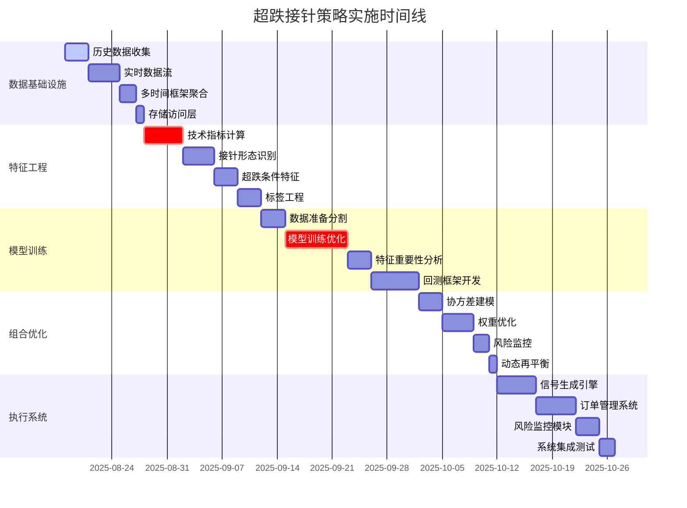

# 超跌接针策略实施计划
## DipCatcher Strategy Implementation Roadmap

### 📋 执行摘要

**策略名称**: DipCatcher_SuperOversold_PinBar  
**实施周期**: 14周 (约3.5个月)  
**总预算**: 资源投入 + 基础设施成本  
**成功标准**: 年化夏普>4, 最大回撤<10%, 胜率>60%

---

## 🚀 阶段化实施路线图

### Phase 1: 数据基础设施建设 (2周)
**Owner**: data-infrastructure-builder  
**Duration**: 10个工作日  
**Start**: Week 1  
**Critical Path**: Yes

#### 关键交付物
1. **历史数据管道** (3天)
   - 收集15个主流币种2.5年1分钟K线数据
   - 数据清洗和格式标准化
   - 缺失数据识别和补全策略

2. **实时数据流** (4天)
   - Binance WebSocket多币种数据流
   - 数据质量监控和异常检测
   - 延迟优化 (<100ms目标)

3. **多时间框架聚合** (2天)
   - 1m → 3m, 5m, 15m数据聚合
   - 时间对齐和同步机制
   - 数据完整性验证

4. **存储和访问层** (1天)
   - 高性能时序数据库部署
   - API接口设计和实现
   - 数据备份和恢复方案

#### 成功标准
- ✅ 数据完整性 >99.5%
- ✅ 实时延迟 <100ms
- ✅ 历史数据无重大缺失
- ✅ 系统可用性 >99.9%

#### 风险缓解
- **数据源风险**: 多个备用数据提供商
- **网络风险**: 冗余网络连接
- **存储风险**: 分布式存储和实时备份

---

### Phase 2: 特征工程与标签生成 (3周)
**Owner**: feature-engineering-labeler  
**Duration**: 15个工作日  
**Dependencies**: Phase 1完成  
**Critical Path**: Yes

#### 关键交付物
1. **技术指标计算** (5天)
   - RSI(14), 布林带, MACD等核心指标
   - 多时间框架指标对齐
   - 计算性能优化和缓存策略

2. **接针形态识别** (4天)
   - Pin Bar模式识别算法
   - 下影线/上影线比例计算
   - 实体位置和成交量确认

3. **超跌条件特征** (3天)
   - 价格偏离度计算
   - 波动率异常检测
   - 支撑阻力位识别

4. **标签工程** (3天)
   - 前瞻性收益标签构建
   - 时间衰减权重设计
   - 标签泄漏检测和防范

#### 成功标准
- ✅ 技术指标精度验证通过
- ✅ 形态识别准确率 >80%
- ✅ 特征计算延迟 <50ms
- ✅ 零前视偏差确认

#### 创新要点
- **多时间框架融合**: 1m精度 + 15m确认
- **动态阈值**: 基于市场波动率的自适应参数
- **模式强度评分**: 量化接针信号的可信度

---

### Phase 3: 模型训练与回测验证 (4周)
**Owner**: model-backtest-validator  
**Duration**: 20个工作日  
**Dependencies**: Phase 2完成  
**Critical Path**: Yes

#### 关键交付物
1. **数据准备和分割** (3天)
   - 时序数据分割策略
   - 训练/验证/测试集划分
   - 数据标准化和预处理

2. **模型选择和训练** (8天)
   - LightGBM, XGBoost, CatBoost对比
   - 时序交叉验证实施
   - 超参数网格搜索优化
   - 集成模型构建

3. **特征重要性分析** (3天)
   - SHAP值分析
   - 特征稳定性测试
   - 相关性和共线性检查

4. **回测框架开发** (6天)
   - 事件驱动回测引擎
   - 交易成本和滑点建模
   - 多币种组合回测
   - 性能归因分析

#### 成功标准
- ✅ 样本外夏普比 >3.5
- ✅ 胜率 >60%
- ✅ 最大回撤 <12%
- ✅ 模型稳定性验证

#### 模型验证流程
1. **时序CV**: Purged CV避免数据泄漏
2. **Walk-Forward**: 滚动窗口验证
3. **Out-of-Sample**: 严格的未来数据测试
4. **Regime Testing**: 不同市场环境下的表现

---

### Phase 4: 组合优化与风险控制 (2周)
**Owner**: portfolio-risk-optimizer  
**Duration**: 10个工作日  
**Dependencies**: Phase 3完成  

#### 关键交付物
1. **协方差矩阵建模** (3天)
   - 动态相关性估计
   - 收缩估计器应用
   - 极端情况建模

2. **组合权重优化** (4天)
   - 均值方差优化
   - 风险预算分配
   - 黑-李特曼模型应用

3. **风险监控系统** (2天)
   - 实时VaR计算
   - 压力测试框架
   - 风险归因分解

4. **动态再平衡** (1天)
   - 再平衡触发条件
   - 交易成本考虑
   - 执行时机优化

#### 成功标准
- ✅ 组合Beta <0.15
- ✅ 集中度风险 <30%
- ✅ VaR准确率 >95%
- ✅ 压力测试通过

---

### Phase 5: 执行系统开发 (3周)  
**Owner**: execution-microstructure-oms  
**Duration**: 15个工作日  
**Dependencies**: Phase 4完成  

#### 关键交付物
1. **信号生成引擎** (5天)
   - 实时特征计算
   - 模型推理服务
   - 信号强度评分

2. **订单管理系统** (5天)
   - 智能订单路由
   - 执行算法(TWAP/VWAP)
   - 滑点优化

3. **风险监控模块** (3天)
   - 实时风险检查
   - 自动止损机制
   - 异常交易检测

4. **系统集成测试** (2天)
   - 端到端流程测试
   - 性能压力测试
   - 故障恢复测试

#### 成功标准
- ✅ 订单执行延迟 <500ms
- ✅ 滑点控制 <0.05%
- ✅ 系统可用性 >99.9%
- ✅ 风险控制实时响应

---

## 🎯 Gate评估框架

### Discovery Gate (Week 2)
**审查委员会**: 策略主管, 风险总监, 技术负责人

#### 通过标准
- [ ] 策略逻辑数学建模完整
- [ ] 数据需求和可获得性确认  
- [ ] 技术架构可行性验证
- [ ] 资源预算和时间表批准
- [ ] 合规和法律要求梳理

**决策**: 继续/修改/终止

---

### Design Gate (Week 5)
#### 通过标准
- [ ] 技术架构文档完整
- [ ] API接口规范确定
- [ ] 数据流设计验证
- [ ] 性能基准测试计划
- [ ] 安全和风控设计评审

**文档要求**: 
- 系统架构图
- 数据库设计文档  
- API规范文档
- 安全设计文档

---

### Implementation Gate (Week 9)
#### 通过标准
- [ ] 核心功能开发完成度 >95%
- [ ] 单元测试覆盖率 >90%
- [ ] 集成测试通过率 >95%
- [ ] 性能测试达到基准
- [ ] 代码审查完成

**验证方式**: 独立测试团队验证

---

### Integration Gate (Week 12)
#### 通过标准
- [ ] 端到端流程完整验证
- [ ] 数据一致性测试通过
- [ ] 风险控制有效性验证
- [ ] 监控告警机制测试
- [ ] 灾难恢复流程测试

**压力测试**: 
- 高频交易压力测试
- 极端市场情况模拟
- 系统故障恢复测试

---

### Production Gate (Week 14+)
#### 通过标准
- [ ] 纸面交易3个月无重大问题
- [ ] 所有风险指标持续达标
- [ ] 系统稳定性 >99.9%
- [ ] 监管合规审查通过
- [ ] 运维流程就绪

**最终批准**: CRO, CTO, CEO三方签字

---

## 📊 依赖关系和关键路径

## ⚠️ 风险管理和应急预案

### 技术风险
- **数据质量问题**: 多源数据交叉验证
- **模型过拟合**: 严格的交叉验证和样本外测试
- **系统延迟**: 冗余架构和性能优化
- **API限制**: 多交易所接入和限流控制

### 市场风险
- **策略失效**: 实时模型监控和自动降仓
- **极端行情**: 紧急停止机制和人工干预
- **流动性风险**: 动态仓位调整和分批执行
- **关联性风险**: 实时相关性监控

### 运营风险
- **人员风险**: 知识文档和交接计划
- **合规风险**: 法律审查和监管报告
- **声誉风险**: 透明沟通和风险披露

### 应急响应
1. **Level 1** (轻微): 自动调整参数
2. **Level 2** (中等): 人工审查和决策
3. **Level 3** (严重): 立即停止交易
4. **Level 4** (危机): 全面风险评估和系统重启

---

## 📈 成功标准和KPI追踪

### 财务指标
- **年化收益率**: 15-25% (目标20%)
- **夏普比率**: >4.0 (目标5.0)
- **最大回撤**: <10% (目标6%)
- **胜率**: >60% (目标65%)

### 运营指标  
- **系统可用性**: >99.9%
- **执行延迟**: <500ms
- **数据准确性**: >99.5%
- **风险监控**: 实时覆盖

### 发展指标
- **策略稳定性**: 12个月滚动夏普>3.0
- **适应性**: 不同市场环境下的一致表现
- **可扩展性**: 支持更多币种和策略扩展

---

## 🔄 持续改进计划

### 月度评估
- 策略表现回顾
- 风险指标分析
- 系统性能优化
- 参数调整建议

### 季度升级
- 模型重训练
- 特征工程优化
- 新币种纳入评估
- 竞争力分析

### 年度审计
- 完整的策略审查
- 架构升级规划
- 合规要求更新
- 团队能力建设

---

**最后更新**: 2025-08-18  
**文档版本**: 1.0.0  
**责任人**: Strategy Orchestrator Agent