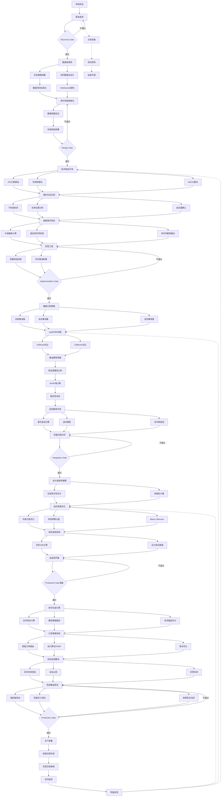
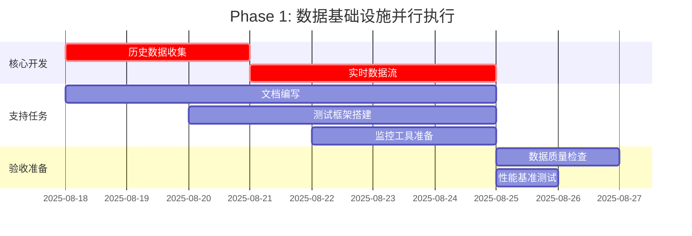
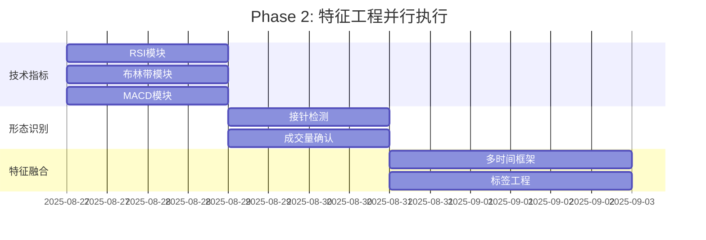
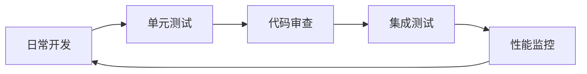
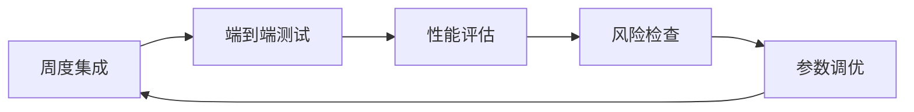
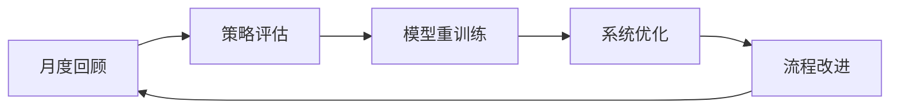
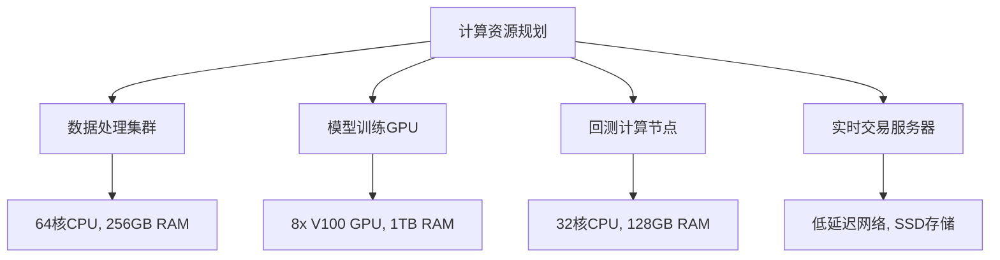
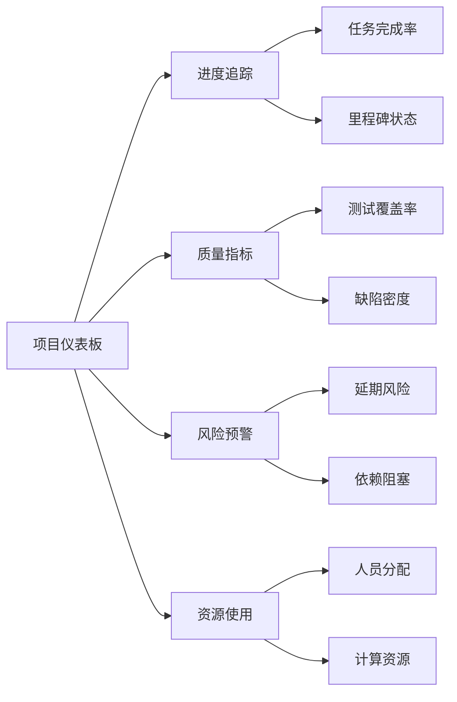
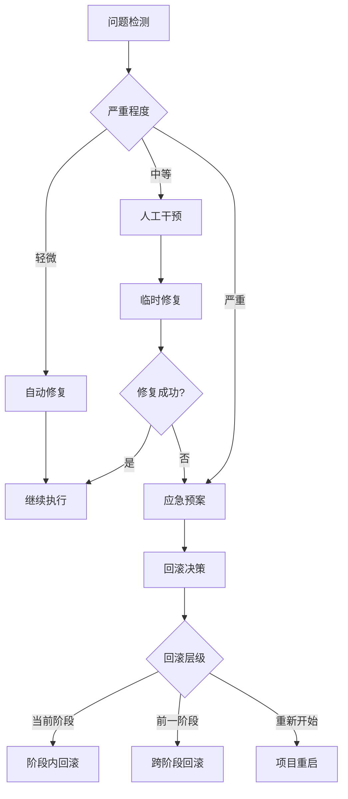

# 超跌接针策略工作流依赖关系图
## DipCatcher Strategy Workflow Dependencies

### 📋 关键路径分析

**总工期**: 14周  
**关键路径**: Phase 1 → Phase 2 → Phase 3 → Phase 4 → Phase 5  
**并行机会**: 有限，主要为文档和测试准备工作  
**风险缓冲**: 每阶段预留10%时间缓冲

---

## 🔄 详细工作流程图



---

## 📊 依赖关系矩阵

| 任务 | 前置依赖 | 后续依赖 | 关键路径 | 缓冲时间 |
|------|----------|----------|----------|----------|
| 数据收集 | 项目启动 | 特征工程 | ✅ | 1天 |
| 实时数据流 | 数据收集 | 特征工程 | ✅ | 2天 |
| 技术指标 | 数据流就绪 | 模型训练 | ✅ | 1天 |
| 形态识别 | 技术指标 | 模型训练 | ✅ | 1天 |
| 标签工程 | 形态识别 | 模型训练 | ✅ | 0天 |
| 模型训练 | 标签工程 | 组合优化 | ✅ | 2天 |
| 回测验证 | 模型训练 | 组合优化 | ✅ | 1天 |
| 组合优化 | 回测验证 | 执行系统 | ✅ | 1天 |
| 风险控制 | 组合优化 | 执行系统 | ✅ | 0天 |
| 执行系统 | 风险控制 | 系统测试 | ✅ | 2天 |
| 集成测试 | 执行系统 | 生产部署 | ✅ | 1天 |

---

## ⚡ 并行执行机会

### Phase 1阶段并行任务


### Phase 2阶段并行任务


---

## 🚨 风险依赖识别

### 高风险依赖
1. **数据质量 → 所有后续阶段**
   - 风险: 数据缺失或错误影响整个流程
   - 缓解: 多源验证，实时监控

2. **模型性能 → 组合优化**
   - 风险: 模型表现不达标影响后续部署
   - 缓解: 多模型backup，早期验证

3. **API稳定性 → 执行系统**
   - 风险: 交易所API限制或中断
   - 缓解: 多交易所接入，降级方案

### 中等风险依赖
1. **特征工程 → 模型训练**
   - 风险: 特征质量影响模型效果
   - 缓解: 特征重要性分析，迭代优化

2. **回测结果 → 生产部署**
   - 风险: 回测与实盘表现差异
   - 缓解: 纸面交易验证，渐进式部署

---

## 🔄 迭代反馈循环

### 短周期反馈 (日级)


### 中周期反馈 (周级)


### 长周期反馈 (月级)


---

## 📈 资源分配和负载均衡

### 团队资源分配
| 阶段 | 数据工程师 | 量化研究员 | 算法工程师 | 系统工程师 | 风险管理 |
|------|------------|------------|------------|------------|----------|
| Phase 1 | 80% | 20% | 10% | 70% | 10% |
| Phase 2 | 60% | 90% | 30% | 20% | 20% |
| Phase 3 | 40% | 80% | 60% | 30% | 40% |
| Phase 4 | 20% | 60% | 40% | 30% | 80% |
| Phase 5 | 30% | 30% | 80% | 90% | 60% |

### 计算资源需求


---

## 🛠️ 质量门控检查点

### 代码质量门控
```yaml
code_quality_gates:
  unit_test_coverage: ">90%"
  integration_test_pass: "100%"
  code_review_approval: "required"
  static_analysis_pass: "no_critical_issues"
  performance_benchmark: "meet_sla_targets"
```

### 数据质量门控
```yaml
data_quality_gates:
  completeness: ">99.5%"
  accuracy: "validated_against_multiple_sources"
  timeliness: "<100ms_latency"
  consistency: "cross_timeframe_alignment"
  integrity: "no_data_corruption"
```

### 模型质量门控
```yaml
model_quality_gates:
  out_of_sample_sharpe: ">3.5"
  win_rate: ">60%"
  max_drawdown: "<12%"
  stability_test: "pass_regime_changes"
  validation_metrics: "independent_verification"
```

---

## 📊 关键里程碑追踪

### 里程碑定义
| 里程碑 | 完成标准 | 验收方 | 时间节点 |
|--------|----------|--------|----------|
| 数据管道就绪 | 历史+实时数据流稳定运行 | 技术负责人 | Week 2 |
| 特征工程完成 | 所有技术指标和形态识别 | 量化研究主管 | Week 5 |
| 模型训练达标 | 样本外夏普>3.5 | 模型验证团队 | Week 9 |
| 组合优化通过 | 风险指标符合限制 | 风险管理委员会 | Week 11 |
| 执行系统就绪 | 端到端测试通过 | 系统架构师 | Week 14 |

### 追踪仪表板


---

## ⚡ 应急预案和回滚策略

### 关键阶段应急预案

#### Phase 1 数据问题应急
- **问题**: 数据源中断或质量问题
- **预案**: 激活备用数据源，启用历史数据补全
- **回滚**: 回到需求澄清阶段，重新评估数据源

#### Phase 3 模型表现不达标
- **问题**: 模型训练结果不满足最低要求
- **预案**: 启用备选算法，调整特征工程
- **回滚**: 回到特征工程阶段，重新设计特征

#### Phase 5 系统集成失败
- **问题**: 端到端测试无法通过
- **预案**: 分模块排查，启用降级方案
- **回滚**: 回到执行系统开发，采用简化架构

### 快速恢复机制


---

**最后更新**: 2025-08-18  
**文档版本**: 1.0.0  
**责任人**: Strategy Orchestrator Agent