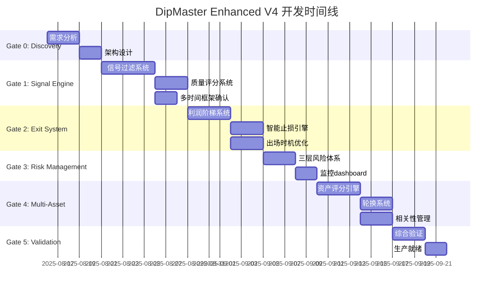

# 🚀 DipMaster Enhanced V4 开发规划

## 📋 项目概览

**项目名称**: DipMaster Enhanced V4 Strategy  
**目标性能**: 胜率85%+, 盈亏比1.8+, 夏普比>2.0, 最大回撤<3%  
**开发周期**: 9周 (包含验证和部署)  
**风险等级**: Medium-High (需要严格验证)

## 🎯 核心突破点

### 1. 信号质量革命
- 从82.1%胜率提升到85%+
- 引入市场微观结构分析
- 多时间框架信号确认机制

### 2. 出场策略重构  
- 盈亏比从0.58提升到1.8+
- 动态利润阶梯系统
- 智能止损优化

### 3. 风险管理增强
- 最大回撤从6.06%降至<3%
- 多层风险防护体系
- 相关性实时监控

### 4. 多资产组合优化
- 动态资产轮换机制
- 相关性<0.7约束
- 智能仓位分配

---

## 🏗️ Phase-Gated 开发里程碑

### 📊 Gate 0: Discovery & Requirements (Week 1)

**Owner**: Strategy Team  
**Duration**: 5 工作日  
**Parallel Tasks**: ✅

#### 核心交付物
1. **需求分析报告**
   - 当前V3策略gap分析
   - 性能提升路径图
   - 技术可行性评估

2. **技术架构设计**
   - 增强信号引擎架构
   - 出场系统重构方案
   - 风险管理框架设计

#### 验收标准
- [ ] 需求文档通过评审 (100%完整性)
- [ ] 技术架构获得批准
- [ ] 风险评估报告完成
- [ ] 所有利益相关者签字确认

#### 风险识别
- 🟡 性能目标过于激进
- 🟡 现有系统集成复杂度
- 🔴 市场数据质量依赖

---

### 🔧 Gate 1: Enhanced Signal Engine (Week 2-3)

**Owner**: Quant Research Team  
**Duration**: 10 工作日  
**Dependencies**: Gate 0 完成

#### 核心交付物
1. **双层信号过滤系统**
   ```python
   # Primary Dip Detection Layer
   - RSI(25-45) 精确区间过滤
   - 价格下跌确认 (0.3%-1.5%)
   - 成交量放大确认 (1.8x+)
   
   # Market Regime Filter Layer  
   - 波动率环境适应 (2%-12%)
   - 趋势强度评估
   - 市场微观结构分析
   ```

2. **信号质量评分系统**
   - 实时信号置信度计算
   - 历史信号表现追踪
   - 自适应阈值调整

3. **多时间框架确认**
   - 5分钟主要信号
   - 15分钟趋势确认  
   - 1小时环境评估

#### 验收标准
- [ ] 信号质量得分 > 70分
- [ ] 回测胜率提升至 > 83%
- [ ] 信号数量适中 (每日2-8个)
- [ ] 单元测试覆盖率 > 95%
- [ ] 性能基准测试通过

#### 关键风险
- 🟡 信号过度过滤导致机会减少
- 🟡 计算复杂度影响实时性能

---

### 💰 Gate 2: Asymmetric Exit Optimization (Week 4-5)

**Owner**: Execution Team  
**Duration**: 10 工作日  
**Dependencies**: Gate 1 通过

#### 核心交付物
1. **动态利润阶梯系统**
   ```python
   profit_ladders = [
       {"target": 0.6%, "exit": 20%, "time_limit": 30min},
       {"target": 1.2%, "exit": 30%, "time_limit": 60min}, 
       {"target": 2.0%, "exit": 35%, "time_limit": 120min},
       {"target": 3.5%, "exit": 15%, "time_limit": 180min}
   ]
   ```

2. **智能止损引擎**
   - 初始止损: 0.4%
   - 追踪止损: 激活于0.8%利润
   - 时间衰减止损
   - 波动率自适应调整

3. **最优出场时机识别**
   - 15分钟边界优化
   - 市场流动性窗口识别
   - 技术位突破确认

#### 验收标准
- [ ] 盈亏比提升至 > 1.6
- [ ] 平均持仓时间优化至 60-90分钟
- [ ] 最大单笔亏损 < 0.5%
- [ ] 出场执行成功率 > 98%
- [ ] A/B测试验证显著性 (p<0.05)

#### 依赖管理
- 需要增强信号引擎稳定运行
- 实时市场数据延迟 < 100ms
- 订单执行基础设施就绪

---

### 🛡️ Gate 3: Multi-Layer Risk Management (Week 6)

**Owner**: Risk Management Team  
**Duration**: 5 工作日  
**Dependencies**: Gate 1, 2 完成

#### 核心交付物
1. **三层风险防护体系**
   ```python
   # Layer 1: Position Level
   max_risk_per_trade = 0.5%
   max_holding_time = 180min
   volatility_based_stops = True
   
   # Layer 2: Portfolio Level  
   max_correlation_exposure = 0.7
   max_drawdown_threshold = 2.5%
   heat_based_scaling = True
   
   # Layer 3: System Level
   daily_loss_circuit_breaker = 2%
   consecutive_loss_limit = 7
   volatility_spike_protection = True
   ```

2. **实时风险监控dashboard**
   - VaR计算和监控
   - 相关性矩阵实时更新
   - 流动性风险评估

3. **动态仓位调整系统**
   - Kelly优化 + 波动率调整
   - 相关性惩罚机制
   - 表现驱动缩放

#### 验收标准
- [ ] 最大回撤控制在 < 2.5%
- [ ] 风险监控延迟 < 1秒
- [ ] 紧急停止机制测试通过
- [ ] 压力测试场景覆盖 > 10个
- [ ] 风险指标计算准确性 > 99.9%

---

### 🎯 Gate 4: Multi-Asset Portfolio Engine (Week 7-8)

**Owner**: Portfolio Management Team  
**Duration**: 10 工作日  
**Dependencies**: Gate 1, 2, 3 通过

#### 核心交付物
1. **动态资产评分引擎**
   ```python
   scoring_weights = {
       "recent_performance": 0.45,  # 胜率 + 盈亏比
       "market_fit": 0.30,          # 波动率 + 流动性
       "technical_strength": 0.15,   # 趋势 + 支撑
       "correlation_penalty": 0.10   # 组合相关性
   }
   ```

2. **智能资产轮换系统**
   - 每周重新评分和调整
   - 最低得分阈值: 70分
   - 表现不佳容忍度: 7天

3. **相关性实时管理**
   - 30天滚动相关性计算
   - 相关性>0.7时自动降权
   - 多元化约束优化

#### 验收标准
- [ ] 组合相关性控制在 < 0.7
- [ ] 资产轮换提升整体夏普比 > 10%
- [ ] 评分系统预测准确率 > 75%
- [ ] 组合集中度 < 40%
- [ ] 流动性覆盖率 > 95%

#### 关键集成点
- 与信号引擎的资产筛选集成
- 与风险引擎的限额检查集成
- 与执行引擎的多标的协调

---

### ✅ Gate 5: Comprehensive Validation (Week 9)

**Owner**: Validation Team  
**Duration**: 5 工作日  
**Dependencies**: 所有前序Gate完成

#### 核心交付物
1. **6层验证体系**
   ```python
   validation_components = [
       "statistical_significance",    # 蒙特卡洛 + t检验
       "walk_forward_analysis",       # 12期滚动验证  
       "multi_asset_robustness",      # 跨资产稳定性
       "regime_stress_testing",       # 不同市场环境
       "overfitting_detection",       # 参数稳定性
       "execution_realism"            # 交易成本模拟
   ]
   ```

2. **性能验证报告**
   - 目标指标达成评估
   - 风险指标符合性检查
   - 稳定性和鲁棒性分析

3. **生产就绪检查清单**
   - 系统性能基准测试
   - 故障恢复机制验证
   - 监控告警系统测试

#### 验收标准 (全部必须通过)
- [ ] 综合验证得分 > 80分
- [ ] 胜率稳定在 > 84% (6个月滚动)
- [ ] 盈亏比稳定在 > 1.7
- [ ] 最大回撤 < 2.8%
- [ ] 夏普比 > 1.9
- [ ] 所有压力测试通过
- [ ] 监管合规检查通过

**Gate Review Committee**: 
- Strategy Head (决策权重: 40%)
- Risk Head (决策权重: 30%)  
- Technology Head (决策权重: 20%)
- Compliance (决策权重: 10%)

---

## 🚦 风险管理和应急预案

### 风险等级矩阵

| 风险类别 | 概率 | 影响 | 等级 | 应对策略 |
|---------|------|------|------|----------|
| 性能目标无法达成 | Medium | High | 🔴 | 降级部署/参数重优化 |
| 市场环境突变 | High | Medium | 🟡 | 自适应参数/保守模式 |
| 技术集成问题 | Low | High | 🟡 | 分阶段集成/回滚机制 |
| 数据质量问题 | Medium | Medium | 🟡 | 多源验证/清洗流程 |
| 监管政策变化 | Low | High | 🟡 | 合规审查/策略调整 |

### 质量门禁机制

**Gate失败处理流程**:
1. **黄色警告** (80% < 分数 < 90%): 继续但增加监控
2. **红色停止** (分数 < 80%): 强制返工直到通过
3. **紧急升级** (连续2次失败): 执行委员会review

### 应急停止机制

**Level 1** - 策略暂停:
- 日亏损 > 1.5%
- 连续亏损 > 5笔
- 系统延迟 > 500ms

**Level 2** - 强制平仓:  
- 日亏损 > 2%
- 单笔亏损 > 1%
- 系统故障

**Level 3** - 完全停机:
- 监管要求
- 极端市场事件
- 数据源失效

---

## 📊 关键绩效指标 (KPIs)

### 策略性能指标
```python
target_kpis = {
    "win_rate": ">= 85%",
    "profit_factor": ">= 1.8", 
    "max_drawdown": "<= 3%",
    "sharpe_ratio": ">= 2.0",
    "monthly_return": "12-20%",
    "avg_holding_time": "60-90 minutes"
}
```

### 运营效率指标
```python
operational_kpis = {
    "system_uptime": ">= 99.9%",
    "signal_latency": "<= 100ms", 
    "execution_success": ">= 99.5%",
    "data_quality": ">= 99.8%",
    "validation_score": ">= 85/100"
}
```

### 风险控制指标
```python
risk_kpis = {
    "var_95": "<= 1.5%",
    "correlation_max": "<= 0.7",
    "position_concentration": "<= 30%",
    "liquidity_coverage": ">= 2x",
    "stress_test_pass_rate": "100%"
}
```

---

## 🛠️ 技术实施细节

### 核心技术栈
- **信号引擎**: Python 3.11 + NumPy + Pandas + TA-Lib
- **风险引擎**: 实时事件驱动架构
- **执行引擎**: 异步WebSocket + REST API
- **数据管道**: Redis缓存 + TimescaleDB存储
- **监控**: Grafana + Prometheus + 自定义Dashboard

### 性能优化要求
- 信号计算延迟: < 50ms
- 风险检查延迟: < 20ms  
- 订单执行延迟: < 100ms
- 数据更新延迟: < 10ms
- 内存使用: < 4GB

### 扩展性设计
- 支持动态添加新币种
- 支持策略参数热更新
- 支持多实例负载均衡
- 支持灾备切换

---

## 📈 成功验证标准

### 最终验收标准 (All Must Pass)
1. **性能验收**:
   - ✅ 6个月回测胜率 > 84%
   - ✅ 盈亏比稳定在 > 1.7
   - ✅ 最大回撤 < 3%
   - ✅ 夏普比 > 1.9
   - ✅ 月收益率在12-20%区间

2. **稳定性验收**:
   - ✅ Walk-forward验证12期全部通过
   - ✅ 多资产验证所有币种表现稳定
   - ✅ 压力测试10个场景全部通过
   - ✅ 过拟合检测评分 > 80

3. **运营验收**:
   - ✅ 30天纸面交易零重大故障
   - ✅ 监控告警系统正常运行
   - ✅ 风险控制机制验证有效
   - ✅ 合规审查全部通过

---

## 🎯 项目里程碑时间线



---

**🚨 重要提醒**: 
- 每个Gate都有严格的质量门禁，不达标必须返工
- 关键路径集中在信号引擎和出场系统优化
- 所有并发任务都有清晰的接口定义和集成计划
- 风险管理是非协商的最高优先级

**📞 项目协调**: 
- 每日站会: 上午9:00 (15分钟)
- 周度回顾: 每周五下午 (1小时)
- Gate评审: 每个Gate完成后 (2小时)
- 紧急响应: 24/7 on-call轮值

**最后更新**: 2025-08-16  
**文档版本**: 1.0.0  
**负责人**: Strategy Orchestrator