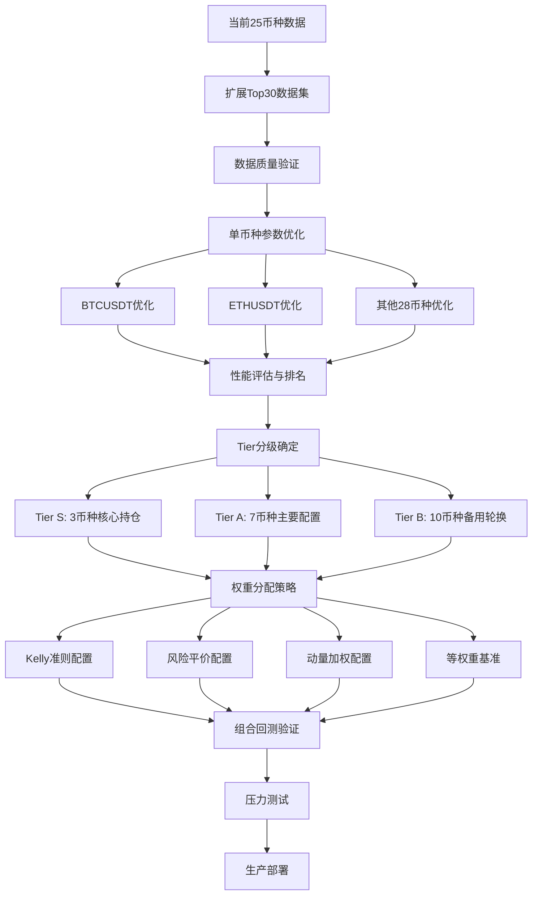

# DipMaster Top30 策略优化工作流程

## 策略编排总览

**目标**: 构建30币种大规模DipMaster策略测试和优化框架，实现目标Sharpe>2.0的高胜率组合策略

**当前状态**: 已有25币种数据基础设施，需扩展5币种达到Top30覆盖

**预期收益**: 
- 组合Sharpe比率 >2.0
- 最大回撤 <6%
- 平均胜率 >78%
- 年化收益 >40%

## 工作流程甘特图

```mermaid
gantt
    title DipMaster Top30 策略优化甘特图
    dateFormat  X
    axisFormat %d

    section Phase 1: 数据扩展
    数据下载 :active, data1, 0, 1
    质量验证 :data2, after data1, 1
    基础设施更新 :data3, after data2, 1

    section Phase 2: 单币种优化  
    参数网格搜索 :opt1, after data3, 2
    性能回测验证 :opt2, after opt1, 2
    最优参数确定 :opt3, after opt2, 1
    综合排名评估 :opt4, after opt3, 2

    section Phase 3: 分级配置
    综合评分计算 :tier1, after opt4, 1
    Tier分级确定 :tier2, after tier1, 1

    section Phase 4: 组合构建
    权重分配策略 :port1, after tier2, 2
    相关性管理 :port2, after port1, 1  
    组合回测验证 :port3, after port2, 2

    section Phase 5: 压力测试
    多环境测试 :stress1, after port3, 2
    蒙特卡洛验证 :stress2, after stress1, 1
    过拟合检测 :stress3, after stress2, 1

    section Phase 6: 生产部署
    最终配置 :deploy1, after stress3, 1
    监控部署 :deploy2, after deploy1, 1
    纸面验证 :deploy3, after deploy2, 1
```

## 依赖关系图

## 阶段里程碑

### Phase 1: 数据基础设施扩展 (3天)

**目标**: 补充5个热门币种，达到Top30覆盖

**关键任务**:
- 下载 SHIBUSDT, DOGEUSDT, TONUSDT, PEPEUSDT, INJUSDT 数据
- 数据质量验证（完整性>98%）
- 更新MarketDataBundle配置

**验收标准**:
- ✅ 30个币种数据完整性>98%
- ✅ 新增币种通过质量检测  
- ✅ 数据管道无错误运行

### Phase 2: 单币种策略优化 (7天)

**目标**: 为每个币种找到最优DipMaster参数组合

**并行执行策略**:
- 批次大小: 6币种同时优化
- 每币种预计耗时: 2小时
- 总共5个批次完成30币种

**参数优化网格**:

| 参数类型 | 候选值 | 优化方法 |
|---------|--------|----------|
| RSI区间 | [25,45], [30,50], [35,55], [20,40], [28,48] | 网格搜索 |
| 最大持仓 | 120, 150, 180, 210, 240分钟 | 交叉验证 |
| 成交量倍数 | 1.5, 1.8, 2.0, 2.5, 3.0 | 贝叶斯优化 |
| 止盈阶梯 | 3种不同组合 | A/B测试 |

**验收标准**:
- ✅ 完成30个币种独立回测
- ✅ 确定每币种最优参数组合
- ✅ 生成综合性能排名报告

### Phase 3: 币种分级配置 (2天)

**目标**: 基于综合评分进行分级和权重分配

**分级标准**:

| 等级 | 数量 | 评分要求 | 胜率要求 | Sharpe要求 | 权重分配 |
|------|------|----------|----------|------------|----------|
| Tier S | 3 | >0.80 | >80% | >2.0 | 50% (每个≤20%) |
| Tier A | 7 | >0.65 | >75% | >1.5 | 35% (每个≤10%) |  
| Tier B | 10 | >0.50 | >70% | >1.0 | 15% (每个≤5%) |
| Tier C | 10 | <0.50 | 监控池 | 暂不配置 | 0% |

**验收标准**:
- ✅ Tier S/A/B分级明确且合理
- ✅ 权重分配符合风险约束
- ✅ 分级结果通过合理性验证

### Phase 4: 组合构建验证 (5天)

**目标**: 构建4种权重分配方法的多币种组合

**权重分配方法对比**:

1. **Kelly准则配置** (30%权重)
   - 基于历史100笔交易
   - 最大Kelly分数25%
   - 置信度调整机制

2. **风险平价配置** (25%权重)  
   - 目标波动率8%
   - 等风险贡献原则
   - 动态再平衡

3. **动量加权配置** (20%权重)
   - 30天滚动表现
   - 趋势跟随逻辑
   - 定期轮换机制

4. **等权重基准** (25%权重)
   - 简单平均分配
   - 基准对比作用
   - 风险分散考虑

**验收标准**:
- ✅ 组合Sharpe比率>1.8
- ✅ 最大回撤<8%
- ✅ 相关性风险可控(<0.7)

### Phase 5: 压力测试验证 (4天)

**目标**: 验证策略在各种市场环境下的鲁棒性

**测试场景**:

1. **历史危机重现**
   - 2022年加密寒冬
   - LUNA崩盘高波动
   - FTX危机流动性枯竭
   - 宏观衰退相关性飙升

2. **蒙特卡洛模拟**
   - 1000次迭代验证
   - 95%置信区间
   - Bootstrap重采样

3. **过拟合检测**
   - 参数敏感性分析
   - 样本外表现比率>75%
   - 复杂度惩罚评分<60%

**验收标准**:
- ✅ 压力测试表现稳定
- ✅ 过拟合检测通过
- ✅ 鲁棒性指标达标

### Phase 6: 生产部署 (3天)

**目标**: 完成最终策略配置和监控系统部署

**部署清单**:
- 最终策略参数配置文件
- 实时监控仪表板
- 风险预警系统
- 纸面交易验证
- 应急处理预案

**验收标准**:
- ✅ 策略配置文件无错误
- ✅ 监控系统功能完整
- ✅ 纸面交易正常运行7天

## 关键成功因素

### 1. 并行处理能力
- **硬件要求**: 16GB内存, 8核CPU
- **批处理策略**: 6币种同时优化
- **云计算备选**: 如本地资源不足

### 2. 数据质量保障
- **完整性检查**: >98%数据可用性
- **异常值处理**: 自动化清洗流程
- **实时监控**: 数据更新状态跟踪

### 3. 风险控制机制
- **仓位限制**: 单币种≤20%, 总仓位≤100%
- **相关性管理**: 币种间相关性<0.7
- **回撤保护**: 组合最大回撤<8%

### 4. 性能基准设定
- **绝对收益**: 年化收益>40%
- **风险调整**: Sharpe比率>2.0
- **稳定性**: 最大回撤<6%
- **执行效率**: 胜率>78%

## 应急预案

### 数据质量问题
- **备选币种**: ICPUSDT, ALGOUSDT, SUIUSDT
- **最小可行宇宙**: 25币种
- **质量阈值降级**: 95% → 90%

### 性能不达标
- **参数扩展**: 增加搜索空间
- **集成方法**: 多模型融合
- **标准放宽**: 阶段性目标调整

### 技术瓶颈
- **云计算升级**: AWS/阿里云资源
- **简化路径**: 减少搜索复杂度
- **分阶段交付**: 渐进式实施

## 监控指标

### 实时跟踪指标
- 30天滚动Sharpe比率
- 当前最大回撤水平
- 50笔交易滚动胜率
- 币种间最大相关性
- 市场波动率状态

### 预警触发条件
- Sharpe比率连续7天<1.0
- 回撤超过5%预警线
- 胜率50笔交易<70%
- 任意币种对相关性>0.8
- 市场波动率剧烈变化

**总体目标**: 在24天内完成大规模30币种DipMaster策略优化，构建高胜率、低回撤的量化交易组合。