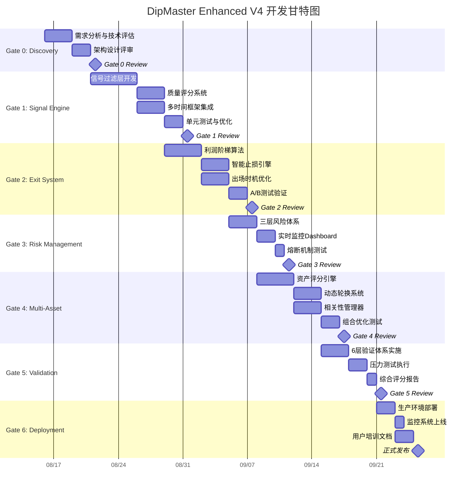
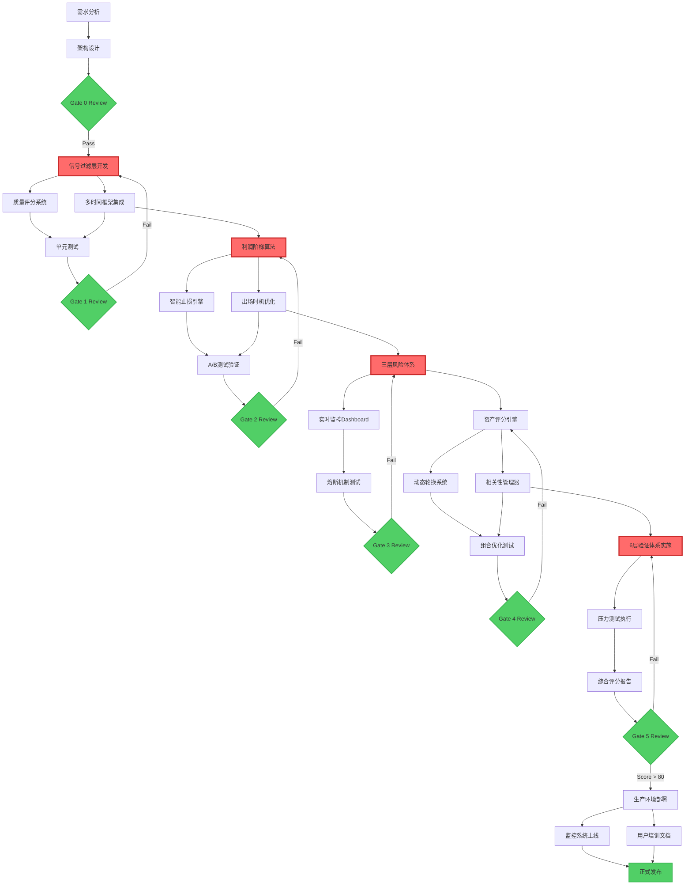

# 🎭 DipMaster Enhanced V4 工作流程编排

## 📋 工作流程总览

**项目代号**: DipMaster Enhanced V4  
**总开发周期**: 9周 (63个工作日)  
**并行任务**: 最多3个同步进行  
**关键路径**: 信号引擎 → 出场系统 → 验证部署  
**风险缓冲**: 每个Gate预留20%时间缓冲

---

## 📊 完整项目Gantt图



---

## 🔗 任务依赖关系图



---

## ⚡ 关键路径分析

### 关键路径识别
```python
critical_path = {
    "path_sequence": [
        "需求分析 → 架构设计 → Gate 0",
        "信号过滤层开发 → 多时间框架集成 → Gate 1", 
        "利润阶梯算法 → 出场时机优化 → Gate 2",
        "三层风险体系 → 相关性管理器 → Gate 4",
        "6层验证体系实施 → 压力测试 → Gate 5",
        "生产环境部署 → 正式发布"
    ],
    "total_duration": 45,  # 工作日
    "buffer_time": 9,      # 20%缓冲时间
    "total_project_time": 54  # 包含缓冲的总时间
}
```

### 并行执行优化
```python
parallel_execution_plan = {
    # Week 1-2: Foundation
    "week_1_2": {
        "parallel_tasks": [
            "需求分析",
            "现有系统评估", 
            "数据质量检查"
        ],
        "max_resources": 3
    },
    
    # Week 3-4: Core Development  
    "week_3_4": {
        "parallel_tasks": [
            "信号过滤层开发",
            "质量评分系统",
            "多时间框架集成"
        ],
        "max_resources": 3
    },
    
    # Week 5-6: Exit & Risk
    "week_5_6": {
        "parallel_tasks": [
            "利润阶梯算法",
            "智能止损引擎", 
            "三层风险体系"
        ],
        "max_resources": 3
    },
    
    # Week 7-8: Portfolio & Validation
    "week_7_8": {
        "parallel_tasks": [
            "资产评分引擎",
            "相关性管理器",
            "验证框架准备"
        ],
        "max_resources": 3
    }
}
```

---

## 🎯 资源分配矩阵

### 人力资源配置
```python
resource_allocation = {
    # 核心团队配置
    "core_team": {
        "quant_researcher": {
            "allocation": "100%",
            "primary_gates": ["Gate 1", "Gate 2"],
            "secondary_gates": ["Gate 4", "Gate 5"],
            "key_skills": ["signal_processing", "statistical_analysis"]
        },
        "risk_manager": {
            "allocation": "80%", 
            "primary_gates": ["Gate 3", "Gate 5"],
            "secondary_gates": ["Gate 2", "Gate 4"],
            "key_skills": ["risk_modeling", "stress_testing"]
        },
        "tech_lead": {
            "allocation": "100%",
            "primary_gates": ["Gate 1", "Gate 3", "Gate 6"],
            "secondary_gates": ["Gate 4"],
            "key_skills": ["system_architecture", "performance_optimization"]
        },
        "portfolio_manager": {
            "allocation": "60%",
            "primary_gates": ["Gate 4"],
            "secondary_gates": ["Gate 2", "Gate 5"],
            "key_skills": ["asset_allocation", "correlation_analysis"]
        },
        "validation_specialist": {
            "allocation": "40%",
            "primary_gates": ["Gate 5"],
            "secondary_gates": ["Gate 1", "Gate 2", "Gate 3", "Gate 4"],
            "key_skills": ["statistical_testing", "backtesting"]
        }
    },
    
    # 外部支持
    "external_support": {
        "strategy_consultant": {
            "allocation": "20%",
            "gates": ["Gate 0", "Gate 5"],
            "expertise": "independent_validation"
        },
        "compliance_officer": {
            "allocation": "10%", 
            "gates": ["Gate 5", "Gate 6"],
            "expertise": "regulatory_compliance"
        }
    }
}
```

### 技术资源需求
```python
technical_resources = {
    # 计算资源
    "compute_infrastructure": {
        "development_servers": {
            "cpu_cores": 64,
            "ram_gb": 256,
            "storage_tb": 10,
            "gpu_units": 2
        },
        "testing_environment": {
            "cpu_cores": 32,
            "ram_gb": 128, 
            "storage_tb": 5,
            "network_bandwidth": "10Gbps"
        },
        "production_environment": {
            "high_availability": True,
            "failover_time": "30s",
            "backup_frequency": "real_time",
            "monitoring": "24/7"
        }
    },
    
    # 数据资源
    "data_infrastructure": {
        "market_data_feeds": ["binance", "coinbase", "kraken"],
        "historical_data": "3_years_minute_level",
        "alternative_data": ["on_chain", "sentiment", "macro"],
        "data_quality_monitoring": "real_time"
    },
    
    # 软件工具
    "software_tools": {
        "development": ["python", "jupyter", "git", "docker"],
        "analytics": ["pandas", "numpy", "scipy", "sklearn"],
        "visualization": ["matplotlib", "plotly", "grafana"],
        "testing": ["pytest", "unittest", "hypothesis"],
        "monitoring": ["prometheus", "elasticsearch", "kibana"]
    }
}
```

---

## 🚦 质量门禁工作流

### Gate Review 流程
```python
gate_review_process = {
    # 评审前准备 (T-2天)
    "pre_review_preparation": {
        "deliverable_submission": "48h_before",
        "self_assessment_completion": "48h_before", 
        "peer_review_initiation": "48h_before",
        "test_results_compilation": "24h_before"
    },
    
    # 评审会议 (T-0天)
    "review_meeting": {
        "duration": "2h",
        "participants": ["gate_owner", "reviewers", "stakeholders"],
        "agenda": [
            "deliverable_presentation (30min)",
            "technical_deep_dive (60min)", 
            "risk_assessment (20min)",
            "go_no_go_decision (10min)"
        ]
    },
    
    # 评审后行动 (T+1天)
    "post_review_actions": {
        "decision_communication": "2h_after",
        "action_items_assignment": "4h_after",
        "next_gate_planning": "24h_after",
        "lessons_learned_capture": "48h_after"
    }
}
```

### 决策框架
```python
gate_decision_framework = {
    # 通过标准
    "pass_criteria": {
        "all_deliverables_complete": True,
        "quality_score": ">= 85%",
        "acceptance_tests_passed": "100%",
        "risk_assessment": "acceptable",
        "stakeholder_approval": "unanimous"
    },
    
    # 条件通过
    "conditional_pass_criteria": {
        "minor_issues_identified": "<= 3",
        "fix_timeline": "<= 2_days",
        "risk_mitigation_plan": "approved",
        "monitoring_enhanced": True
    },
    
    # 失败标准
    "fail_criteria": {
        "major_deliverable_missing": True,
        "quality_score": "< 70%",
        "critical_bugs_found": ">= 1",
        "unacceptable_risk": True,
        "stakeholder_veto": True
    }
}
```

---

## 📈 进度监控和报告

### 日常监控指标
```python
daily_monitoring_kpis = {
    # 进度指标
    "progress_metrics": {
        "tasks_completed_today": {"target": ">= 3"},
        "milestone_progress": {"format": "percentage"},
        "critical_path_status": {"colors": ["green", "yellow", "red"]},
        "team_velocity": {"unit": "story_points_per_day"}
    },
    
    # 质量指标
    "quality_metrics": {
        "code_coverage": {"target": ">= 90%"},
        "unit_test_pass_rate": {"target": "100%"},
        "bug_discovery_rate": {"target": "<= 2_per_day"},
        "technical_debt_ratio": {"target": "<= 10%"}
    },
    
    # 风险指标
    "risk_metrics": {
        "schedule_variance": {"acceptable_range": "[-2, +1]_days"},
        "resource_utilization": {"target": "80-95%"},
        "dependency_delays": {"target": "0"},
        "scope_creep_incidents": {"target": "0"}
    }
}
```

### 周度状态报告
```python
weekly_status_report = {
    # 执行摘要
    "executive_summary": {
        "overall_health": "RAG_status",
        "key_achievements": "bullet_points",
        "critical_issues": "escalation_required",
        "next_week_focus": "top_3_priorities"
    },
    
    # 详细进展
    "detailed_progress": {
        "completed_tasks": "with_evidence",
        "in_progress_tasks": "with_timeline",
        "blocked_tasks": "with_resolution_plan",
        "upcoming_milestones": "with_confidence_level"
    },
    
    # 风险和问题
    "risks_and_issues": {
        "new_risks_identified": "with_mitigation",
        "risk_status_updates": "trend_analysis",
        "issue_resolution": "action_owners",
        "escalation_items": "for_management"
    }
}
```

---

## 🔄 变更管理流程

### 变更控制委员会
```python
change_control_board = {
    # 委员会组成
    "board_members": {
        "change_control_manager": {"authority": "process_oversight"},
        "technical_architect": {"authority": "technical_impact"},
        "risk_manager": {"authority": "risk_assessment"},
        "business_stakeholder": {"authority": "business_impact"}
    },
    
    # 变更分类
    "change_categories": {
        "trivial": {"approval": "automatic", "timeline": "immediate"},
        "minor": {"approval": "manager_only", "timeline": "24h"},
        "major": {"approval": "ccb_review", "timeline": "72h"},
        "critical": {"approval": "emergency_process", "timeline": "immediate"}
    },
    
    # 评估标准
    "change_assessment_criteria": {
        "scope_impact": ["none", "minor", "moderate", "major"],
        "schedule_impact": ["none", "< 1d", "1-3d", "> 3d"],
        "resource_impact": ["none", "< 20%", "20-50%", "> 50%"],
        "risk_impact": ["reduce", "neutral", "increase", "significant"]
    }
}
```

---

## 🎯 成功交付保证机制

### 质量保证检查点
```python
quality_assurance_checkpoints = {
    # 每日质量检查
    "daily_qa": {
        "code_review_completion": "100%",
        "automated_test_execution": "green_build",
        "documentation_updates": "current",
        "integration_smoke_tests": "passing"
    },
    
    # 每周质量审查
    "weekly_qa": {
        "architecture_compliance": "verified",
        "performance_benchmarks": "within_targets",
        "security_scan_results": "no_critical_issues",
        "technical_debt_assessment": "managed"
    },
    
    # Gate质量验证
    "gate_qa": {
        "end_to_end_testing": "complete",
        "performance_validation": "meets_sla",
        "security_penetration_test": "passed",
        "scalability_testing": "verified"
    }
}
```

### 应急响应计划
```python
contingency_plans = {
    # 关键人员不可用
    "key_personnel_unavailable": {
        "backup_assignments": "pre_defined",
        "knowledge_transfer": "documented",
        "external_contractor": "on_standby",
        "timeline_adjustment": "automatic"
    },
    
    # 技术阻塞
    "technical_blockers": {
        "alternative_approaches": "researched",
        "vendor_escalation": "immediate",
        "scope_reduction": "pre_approved",
        "timeline_rebaseline": "authorized"
    },
    
    # 外部依赖延迟
    "external_dependency_delays": {
        "vendor_management": "escalated",
        "workaround_solutions": "implemented",
        "parallel_development": "initiated",
        "risk_mitigation": "activated"
    }
}
```

---

## 📊 项目成功指标

### 交付成功标准
```python
delivery_success_criteria = {
    # 时间指标
    "schedule_performance": {
        "on_time_delivery": ">= 95%",
        "milestone_adherence": ">= 90%", 
        "critical_path_variance": "<= 5%",
        "early_delivery_bonus": "possible"
    },
    
    # 质量指标
    "quality_performance": {
        "defect_density": "<= 1_per_kloc",
        "customer_satisfaction": ">= 4.5/5",
        "performance_targets": "100%_met",
        "reliability_targets": ">= 99.9%"
    },
    
    # 成本指标
    "cost_performance": {
        "budget_variance": "<= 10%",
        "resource_efficiency": ">= 90%",
        "rework_percentage": "<= 5%",
        "total_cost_of_ownership": "minimized"
    }
}
```

---

**🎯 工作流程核心原则**: 
1. **并行执行最大化** - 减少关键路径长度
2. **质量门禁严格执行** - 确保每个阶段质量
3. **风险预防优于应对** - 提前识别和缓解风险
4. **透明沟通持续进行** - 所有利益相关者信息同步

**📈 项目成功关键**: 
- 严格遵循Gate Review流程
- 保持团队高效协作
- 持续监控和快速响应
- 质量第一，进度第二

**最后更新**: 2025-08-16  
**工作流版本**: V4.0.0  
**负责人**: Project Orchestrator